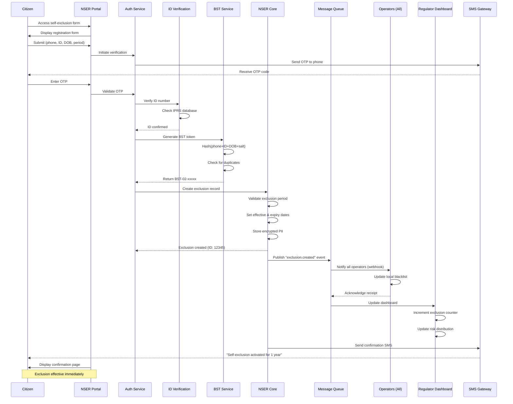
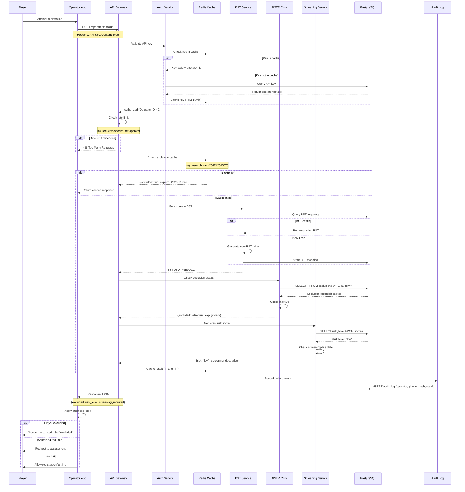
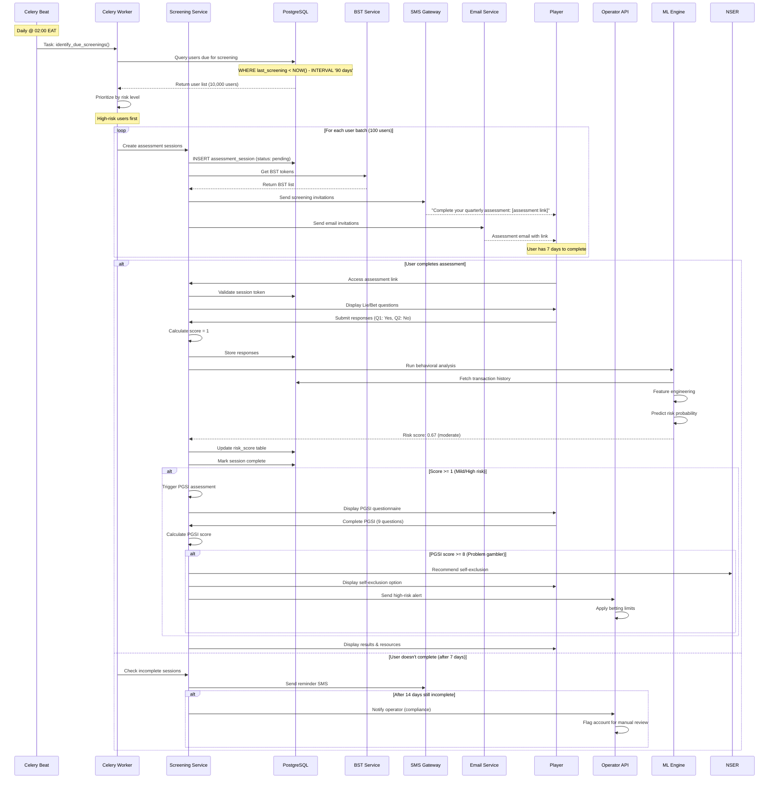
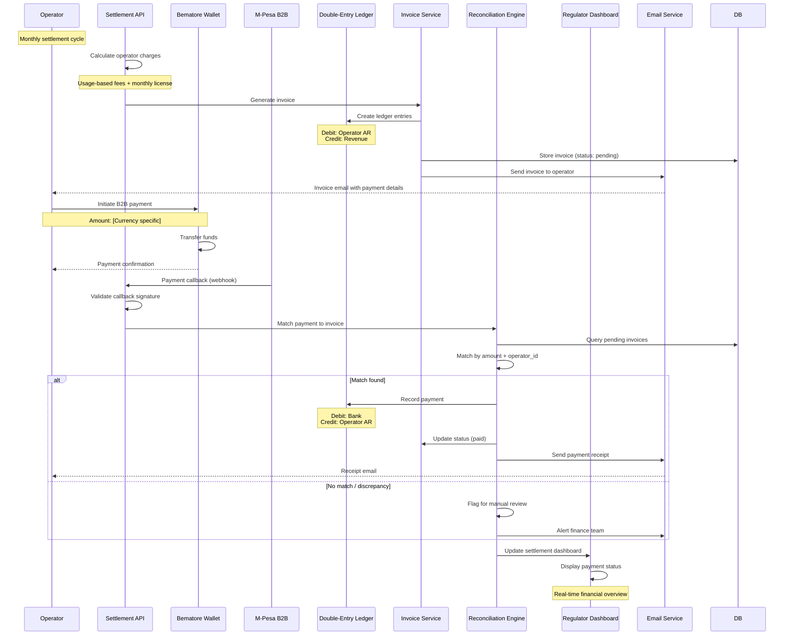
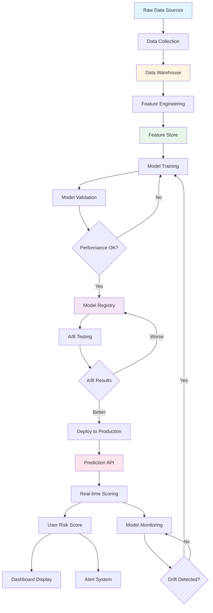
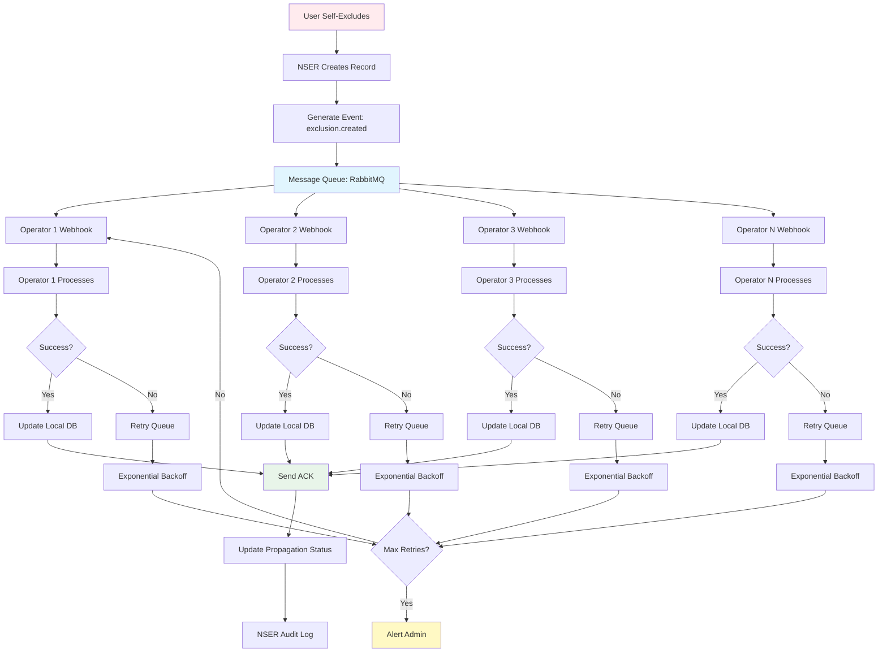
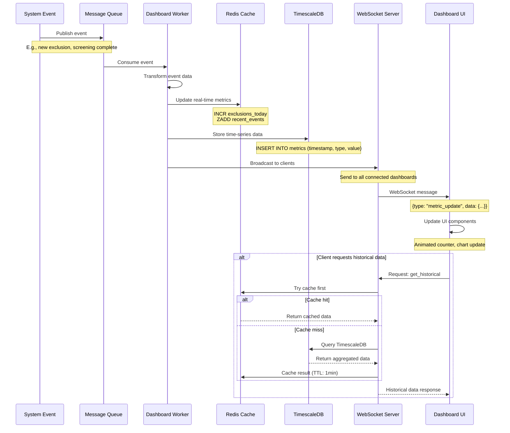
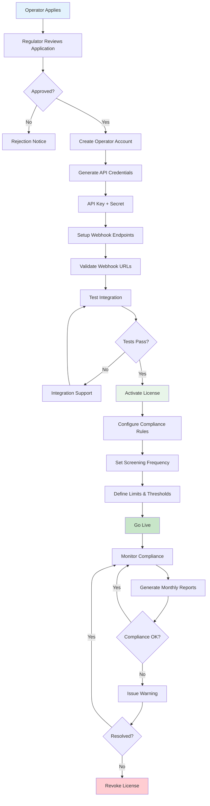
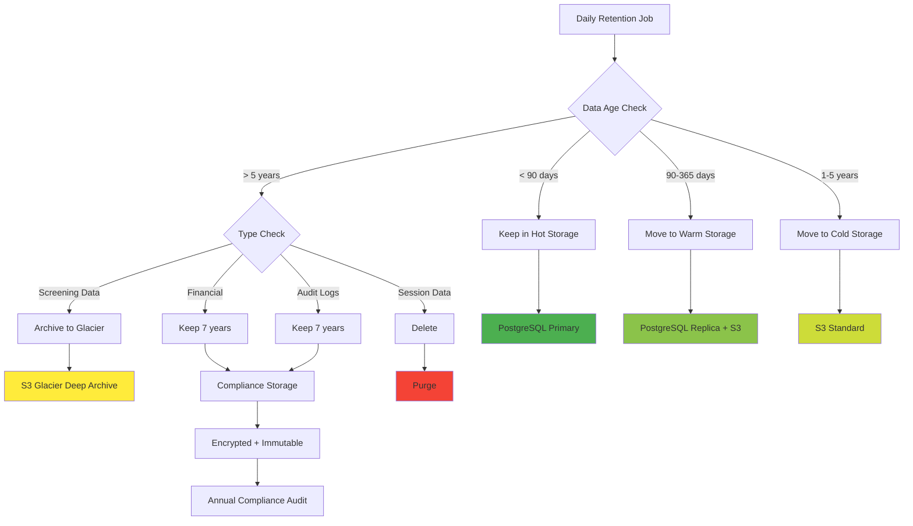
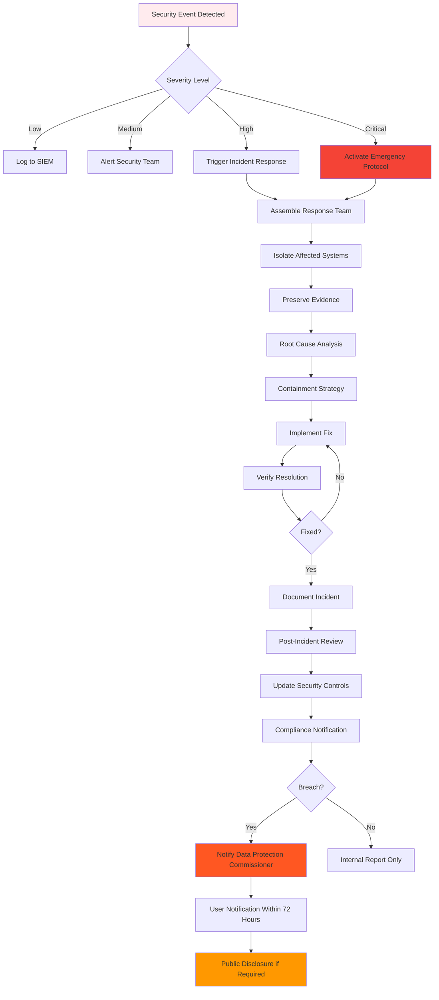

# Data Flow Diagrams & Sequence Diagrams

## 1. Complete User Self-Exclusion Registration Flow



---

## 2. Operator Real-Time Lookup Flow



---

## 3. Quarterly Automated Screening Flow



---

## 4. Financial Settlement Flow



---

## 5. ML Model Training & Prediction Pipeline



### Detailed ML Pipeline Steps

#### 1. Data Collection (Daily)
```python
Sources:
- screening.assessmentresponse (user responses)
- nser.selfexclusionrecord (exclusion history)
- operators.bettingactivity (transaction data)
- users.useractivity (login patterns, device info)
- external.economicdata (unemployment, GDP)

Volume: 1M+ records/day
Storage: S3 Data Lake (Parquet format)
```

#### 2. Feature Engineering (Hourly)
```python
Features (150+):
- Betting frequency (7d, 30d, 90d averages)
- Loss chasing indicators (increasing bet sizes after losses)
- Time-of-day patterns (late-night betting)
- Deposit velocity (sudden increase in deposits)
- Social features (betting with friends)
- Economic stress indicators (payday patterns)
- Assessment scores (historical PGSI, Lie/Bet)
- Demographics (age group, location)

Output: Feature vectors (numpy arrays)
Storage: Redis (hot) + S3 (cold)
```

#### 3. Model Training (Weekly)
```python
Algorithms:
1. XGBoost (primary model)
   - Hyperparameters: 100 trees, max_depth=6, learning_rate=0.1
   - Training data: 500k labeled examples
   - Validation: 5-fold cross-validation
   - Metrics: AUC-ROC=0.94, Precision=0.89, Recall=0.91

2. LSTM (for time-series patterns)
   - Architecture: 2 LSTM layers (128, 64 units) + Dense
   - Sequence length: 90 days
   - Metrics: AUC-ROC=0.92

3. Ensemble (voting classifier)
   - Combines XGBoost + LSTM + Logistic Regression
   - Weights: 0.5, 0.3, 0.2
   - Metrics: AUC-ROC=0.95
```

#### 4. Model Deployment (CI/CD)
```python
Deployment Strategy:
- Canary deployment (5% → 20% → 100%)
- A/B testing (champion vs. challenger)
- Blue-green deployment for rollback
- Model versioning (MLflow)
- API endpoint: /api/v1/ml/predict

Performance:
- Latency: <50ms (P95)
- Throughput: 10,000 predictions/second
- Availability: 99.9%
```

---

## 6. Multi-Operator Exclusion Propagation



### Propagation Details

**Webhook Payload**:
```json
{
  "event_id": "evt_7a8b9c0d1e2f3g4h",
  "event_type": "exclusion.created",
  "timestamp": "2025-11-04T09:18:00Z",
  "version": "1.0",
  "data": {
    "bst": "BST-02-A7F3E9D2C1B8F4A6E3D9C7B2F1A8E5D3-C4B9",
    "exclusion_type": "self_exclusion",
    "period": "1_year",
    "effective_date": "2025-11-04T09:18:00Z",
    "expiry_date": "2026-11-04T09:18:00Z",
    "revocable": false
  },
  "signature": "sha256=abcdef123456..." // HMAC signature
}
```

**Retry Policy**:
```python
retry_delays = [1s, 2s, 4s, 8s, 16s, 32s, 64s, 128s, 256s]
max_retries = 9
total_time = ~8.5 minutes

After max retries:
- Log failure to database
- Alert compliance team
- Display in Regulator dashboard (operator non-compliance)
- Escalate to manual intervention

**Propagation Status Tracking**:
- Real-time webhook delivery status in operator dashboard
- Audit trail of all failed propagations
- Manual retry capability for compliance team
- Notifications to operator support for troubleshooting

**Propagation Metrics**:
- Target: <5 seconds to all operators
- Success Rate: 99.95%
- Failed Propagations: <0.05% (manual follow-up)

---

## 7. Dashboard Real-Time Update Flow



---

## 8. Operator Onboarding Flow



---

## 9. Data Retention & Archival Flow



---

## 10. Security Incident Response Flow



---

## Data Flow Summary

### High-Volume Flows
1. **Operator Lookups**: 10,000 req/s → Cache → NSER → Response (<50ms)
2. **Screening Events**: 100,000/day → Queue → ML → Database
3. **Dashboard Updates**: Real-time WebSocket → 1000 concurrent connections
4. **Transaction Logs**: 5M/day → TimescaleDB → Archival

### Low-Latency Flows
- Exclusion lookup: <50ms (P99)
- BST generation: <30ms
- Risk score retrieval: <20ms (cached)
- Dashboard metric: <100ms

### High-Reliability Flows
- Exclusion propagation: 99.95% success rate
- Webhook delivery: 99.9% with retries
- Payment processing: 100% reconciliation

### Compliance-Critical Flows
- Audit logging: Write-once, immutable
- Data retention: Automated with compliance checks
- Incident response: <15 min to containment
