# NSER-RG System Use Cases & Architecture

## Complete Use Cases Diagram

```mermaid
graph TB
    subgraph Actors
        Citizen[👤 Citizen/Gambler]
        Operator[🎰 Gambling Operator]
        Regulator[👨‍💼 Regulator Officer]
        Admin[👨‍💻 System Admin]
        Counselor[👨‍⚕️ Counselor]
    end
    
    subgraph "Self-Exclusion Use Cases"
        UC1[Register Self-Exclusion]
        UC2[Check Exclusion Status]
        UC3[Extend Exclusion Period]
        UC4[View Exclusion History]
        UC5[Lift Exclusion Early Admin]
    end
    
    subgraph "Screening Use Cases"
        UC6[Complete Lie/Bet Assessment]
        UC7[Complete PGSI Assessment]
        UC8[Complete DSM-5 Assessment]
        UC9[View Risk Score]
        UC10[Schedule Quarterly Screening]
        UC11[View Assessment History]
    end
    
    subgraph "Operator Integration Use Cases"
        UC12[Register New Operator]
        UC13[Lookup User Exclusion]
        UC14[Batch Lookup Users]
        UC15[Receive Webhook Notifications]
        UC16[View Compliance Report]
        UC17[Manage API Keys]
    end
    
    subgraph "User Management Use Cases"
        UC18[Register Account]
        UC19[Login with 2FA]
        UC20[Update Profile]
        UC21[Verify Identity Phone/ID]
        UC22[Change Password]
        UC23[Request Data Export]
        UC24[Delete Account]
    end
    
    subgraph "Dashboard & Reporting Use Cases"
        UC25[View Regulator Dashboard]
        UC26[View Operator Dashboard]
        UC27[Generate Compliance Report]
        UC28[View Real-time Analytics]
        UC29[Export Statistical Data]
        UC30[Configure Alerts]
    end
    
    subgraph "BST Token Use Cases"
        UC31[Generate BST Token]
        UC32[Validate BST Token]
        UC33[View Token History]
        UC34[Rotate Compromised Token]
    end
    
    subgraph "Settlement & Financial Use Cases"
        UC35[Process Operator Payment]
        UC36[View Transaction History]
        UC37[Generate Invoice]
        UC38[Reconcile Payments]
        UC39[View Financial Reports]
    end
    
    subgraph "Administration Use Cases"
        UC40[Manage Users]
        UC41[Configure System Settings]
        UC42[View Audit Logs]
        UC43[Manage Permissions]
        UC44[Monitor System Health]
        UC45[Handle Data Breach]
    end
    
    Citizen --> UC1
    Citizen --> UC6
    Citizen --> UC7
    Citizen --> UC8
    Citizen --> UC9
    Citizen --> UC11
    Citizen --> UC18
    Citizen --> UC19
    Citizen --> UC20
    Citizen --> UC21
    Citizen --> UC22
    Citizen --> UC23
    Citizen --> UC24
    Citizen --> UC4
    
    Operator --> UC12
    Operator --> UC13
    Operator --> UC14
    Operator --> UC15
    Operator --> UC16
    Operator --> UC17
    Operator --> UC26
    Operator --> UC35
    Operator --> UC36
    
    Regulator --> UC2
    Regulator --> UC3
    Regulator --> UC5
    Regulator --> UC25
    Regulator --> UC27
    Regulator --> UC28
    Regulator --> UC29
    Regulator --> UC30
    Regulator --> UC16
    
    Admin --> UC40
    Admin --> UC41
    Admin --> UC42
    Admin --> UC43
    Admin --> UC44
    Admin --> UC45
    Admin --> UC38
    Admin --> UC39
    
    Counselor --> UC9
    Counselor --> UC11
    Counselor --> UC7
    Counselor --> UC8
    
    style UC1 fill:#ffebee
    style UC6 fill:#e3f2fd
    style UC13 fill:#f3e5f5
    style UC25 fill:#e8f5e9
    style UC35 fill:#fff9c4
```

---

## Detailed Use Case Flow Diagrams

### 1. Complete User Journey: Registration to Self-Exclusion

---

### 2. Operator Lookup & Validation Flow

```mermaid
sequenceDiagram
    actor User
    participant OpPlatform as Operator Platform
    participant API as API Gateway
    participant Auth as Auth Service
    participant BST as BST Service
    participant NSER as NSER Service
    participant Cache as Redis Cache
    participant DB as PostgreSQL
    participant ML as ML Engine
    
    User->>OpPlatform: Attempt Registration/Bet
    OpPlatform->>API: POST /api/v1/operators/lookup
    Note over OpPlatform,API: Headers: Authorization: Bearer {api_key}
    
    API->>Auth: Validate API Key
    Auth->>API: ✓ Valid Operator
    
    API->>API: Check Rate Limit (100 req/s)
    
    alt Rate Limit Exceeded
        API->>OpPlatform: 429 Too Many Requests
    else Within Limit
        API->>BST: Lookup/Generate BST
        BST->>Cache: Check BST Cache
        
        alt BST Exists in Cache
            Cache->>BST: Return Cached BST
        else Generate New BST
            BST->>BST: Generate BST Token
            BST->>DB: Store BST Mapping
            BST->>Cache: Cache BST (TTL: 1hr)
        end
        
        BST->>API: Return BST Token
        
        API->>NSER: Check Exclusion Status
        NSER->>Cache: Check Exclusion Cache
        
        alt Cache Hit
            Cache->>NSER: Return Cached Status
        else Cache Miss
            NSER->>DB: Query Exclusion Table
            DB->>NSER: Exclusion Record
            NSER->>Cache: Cache Result (TTL: 5min)
        end
        
        NSER->>ML: Get Risk Score
        ML->>Cache: Check Risk Cache
        
        alt Risk Score Cached
            Cache->>ML: Return Risk Score
        else Calculate Risk
            ML->>DB: Fetch Behavioral Data
            ML->>ML: Run Prediction Model
            ML->>Cache: Cache Risk Score
        end
        
        ML->>NSER: Risk Score
        NSER->>API: Compiled Response
        
        API->>OpPlatform: Response JSON
        Note over API,OpPlatform: {excluded: false, risk_level: "low",<br/>requires_screening: false}
        
        OpPlatform->>OpPlatform: Apply Business Rules
        
        alt User Excluded
            OpPlatform->>User: ❌ Block Registration/Betting
        else High Risk
            OpPlatform->>User: ⚠️ Trigger Mandatory Screening
        else Low Risk
            OpPlatform->>User: ✓ Allow with Monitoring
        end
    end
```

---

### 3. Regulator Compliance Monitoring Flow

---

### 4. ML-Powered Risk Assessment Architecture

---

### 5. Settlement & Financial Reconciliation Flow

---

## System Integration Architecture

---

## Use Case Priority Matrix

| Priority | Use Case | Actor | Frequency | Complexity |
|----------|----------|-------|-----------|------------|
| **P0** | Lookup User Exclusion | Operator | Real-time | Low |
| **P0** | Register Self-Exclusion | Citizen | Daily | Medium |
| **P0** | Validate BST Token | System | Real-time | Low |
| **P1** | Complete Lie/Bet Assessment | Citizen | Weekly | Low |
| **P1** | Receive Webhook Notifications | Operator | Real-time | Medium |
| **P1** | View Regulator Dashboard | Regulator Officer | Daily | Medium |
| **P2** | Complete PGSI Assessment | Citizen | Monthly | Medium |
| **P2** | Generate Compliance Report | Regulator Officer | Monthly | High |
| **P2** | Process Operator Payment | System | Monthly | High |
| **P3** | Export Statistical Data | Regulator Officer | Quarterly | Medium |
| **P3** | Rotate Compromised Token | Admin | As needed | Medium |
| **P3** | Handle Data Breach | Admin | Rare | High |

---

## Security Use Cases

---

## Performance & Scalability Requirements

| Use Case | SLA Target | Current Performance | Scalability |
|----------|------------|---------------------|-------------|
| Exclusion Lookup | <50ms (P99) | 45ms | Horizontal scaling ready |
| User Registration | <200ms | 187ms | Auto-scaling enabled |
| Risk Prediction | <100ms | 67ms | ML model caching |
| Dashboard Load | <500ms | 234ms | Redis caching |
| Webhook Delivery | <5s to all operators | 3.2s | Async fan-out |
| Payment Processing | <2s | 1.8s | M-Pesa API optimized |
| Report Generation | <10s | 8.5s | Background job |
| Data Export | <30s | 24s | Celery worker |

---

This comprehensive use case documentation covers all major system interactions, flows, and integration points for the NSER-RG platform.
